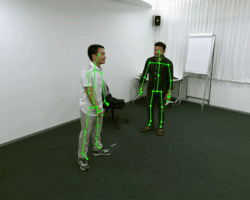
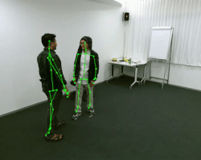

# NTU-RGB-Skeleton-Python

Functionalities:

1. Read the .skeleton file provided in NTU RGB skeleton dataset and get the x and y coordinates of the skeleton points in each frame for each subjects. Usage ```python read_skeleton.py --skel=PATH TO .SKELETON FILE```
2. Read both the .skeleton file and the corresponding RGB video file provided in NTU RGB skeleton dataset to draw the skeleton joints as defined in their research paper here : [http://openaccess.thecvf.com/content_cvpr_2016/papers/Shahroudy_NTU_RGBD_A_CVPR_2016_paper.pdf](http://openaccess.thecvf.com/content_cvpr_2016/papers/Shahroudy_NTU_RGBD_A_CVPR_2016_paper.pdf) Usage :  ```python read_skeleton.py --skel=PATH TO .SKELETON FILE --video=PATH TO .AVI FILE```
3. Optional arguments : 
				a)```python read_skeleton.py --skel=PATH TO .SKELETON FILE --video=PATH TO .AVI FILE --frame_height=FRAME HEIGHT --frame_width=FRAME WIDTH``` to control the height and width of the displayed frame.
				b)     ```python read_skeleton.py --skel=PATH TO .SKELETON FILE --subject_ID``` to get each subject's ID from each frame.     
				c) ```python read_skeleton.py --skel=PATH TO .SKELETON FILE --video=PATH TO .AVI FILE --save``` to save the video on the disk.


**Demo**





**License**
-------
**MIT**

